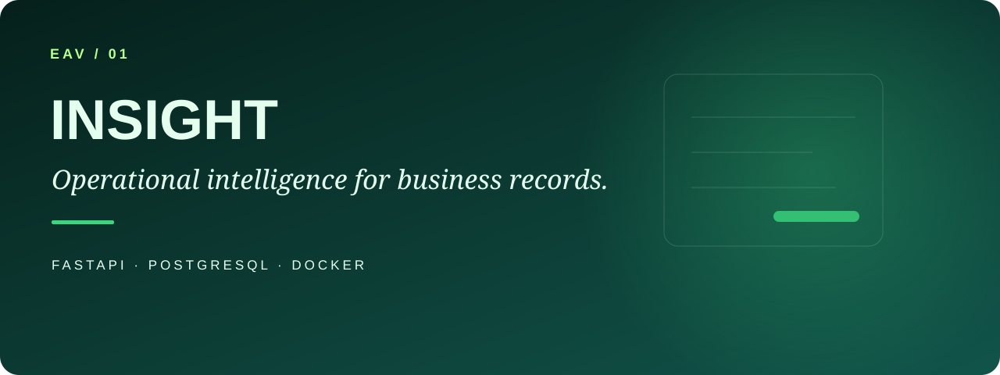
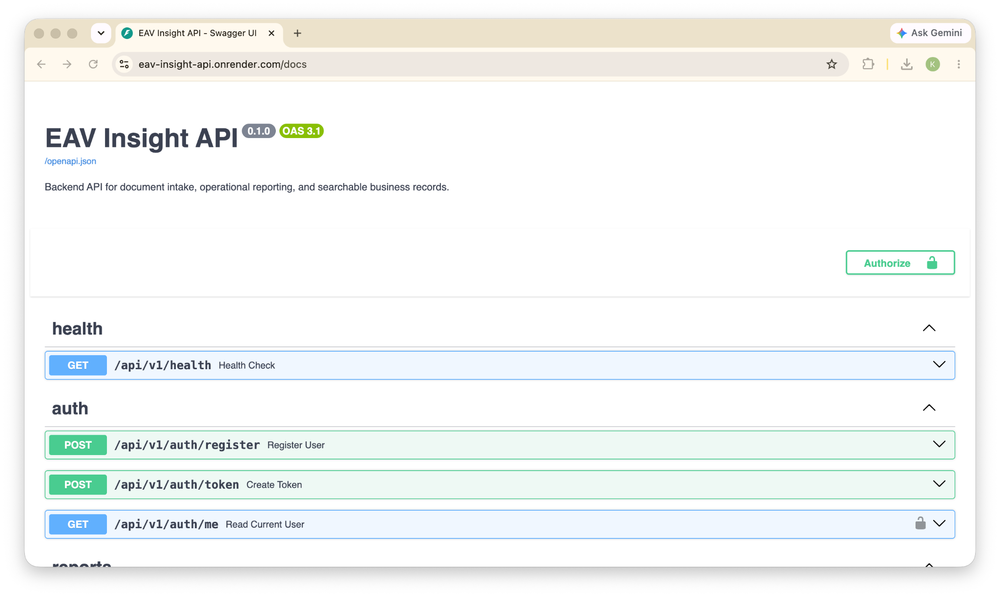

<p align="center"></p>

# EAV Insight API

[](https://github.com/eav-labs-dev/eav-insight-api/actions/workflows/ci.yml)

FastAPI backend for document intake, operational reporting, and searchable business records.

## Project Status

This repository is part of the EAV Labs portfolio rebuild and is currently under active development.

## Live Demo

The API is deployed on Render:

- Base URL: `https://eav-insight-api.onrender.com`
- Health check: `https://eav-insight-api.onrender.com/api/v1/health`
- OpenAPI docs: `https://eav-insight-api.onrender.com/docs`

This deployment is intended as a portfolio demo environment for reviewing the API structure, documentation, and backend workflow.

## Screenshots

### OpenAPI Documentation



The live Swagger/OpenAPI interface shows the health, authentication, report, and document API groups.

## What This Project Demonstrates

EAV Insight API is designed as a production-style backend service. It demonstrates backend API design, typed Python development, environment-based configuration, Dockerized local development, automated testing, CI, and documentation discipline.

## Core Features

- FastAPI application factory and versioned API routes
- SQLAlchemy models and Alembic migrations
- JWT authentication and organization-scoped access
- Report and document CRUD
- Search, filtering, sorting, and pagination metadata
- Consistent API error responses
- PostgreSQL and Redis development services
- Docker / Docker Compose
- Pytest, Ruff, and GitHub Actions CI
- Render Blueprint and deployment smoke checks

## Tech Stack

Python 3.12 · FastAPI · PostgreSQL · Redis · Docker · Pytest · Ruff · GitHub Actions

## Local Development

```bash
python3 -m venv .venv
source .venv/bin/activate
python -m pip install --upgrade pip
pip install -e ".[dev]"
cp .env.example .env
uvicorn app.main:app --reload
```

API: `http://localhost:8000`  
Docs: `http://localhost:8000/docs`  
Health: `http://localhost:8000/api/v1/health`

## Docker Development

```bash
cp .env.example .env
docker compose up --build
docker compose exec api alembic upgrade head
docker compose exec api python scripts/seed_demo_data.py
```

See [`docs/development.md`](docs/development.md) for the full development workflow.

## Quick Demo Workflow

After the stack is running and demo data is seeded:

```bash
make demo-api
```

The demo logs in, reads the current user, creates and filters reports, registers document metadata, lists documents, and demonstrates validation errors. Full request examples are in [`docs/api-examples.md`](docs/api-examples.md).

## Authentication

Current endpoints:

```text
POST /api/v1/auth/register
POST /api/v1/auth/token
GET  /api/v1/auth/me
```

Business endpoints require bearer authentication and records are scoped to the authenticated user's organization.

## Verification

```bash
pytest
ruff check .
make check
```

Useful Makefile commands include `make install`, `make dev`, `make test`, `make lint`, `make migration-check`, `make docker-build`, `make docker-up`, `make docker-migrate`, `make docker-seed`, and `make check-deploy`.

## Deployment

The public portfolio demo uses Render with Docker and Render Postgres. Deployment assets include `render.yaml`, `scripts/render_release.sh`, and `scripts/check_deployment.sh`.

See [`docs/deployment-render.md`](docs/deployment-render.md) for deployment details.

## API Surface

The service exposes health, authentication, report, and document endpoints under `/api/v1`. Report and document lists support practical search, filtering, sorting, and offset pagination, with response metadata for next and previous pages.

## Project Structure

```text
app/        API, core configuration, persistence, models, schemas
alembic/    database migrations
docs/       architecture, development, API and deployment notes
scripts/    demo, seed and deployment utilities
tests/      automated tests
```

## Roadmap

See [`docs/roadmap.md`](docs/roadmap.md).

---

**EAV / 01** · Part of [EAV Labs](https://github.com/eav-labs-dev), independent engineering work by [Enam Avornyo](https://github.com/enamavornyo).
