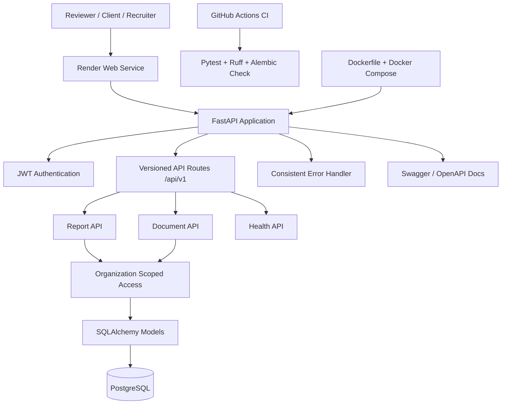
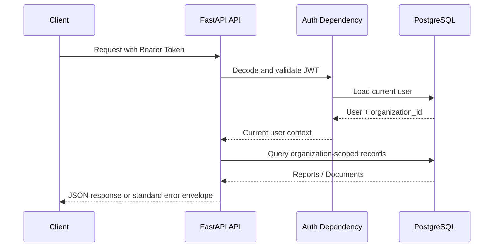

# EAV Insight API — Architecture Diagram

## System Overview

## Request Flow

## Core Design Choices

| Choice | Reason |
|---|---|
| FastAPI | Clean API development, validation, OpenAPI documentation |
| SQLAlchemy | Explicit relational data modelling |
| Alembic | Database migration discipline |
| PostgreSQL | Production-style relational persistence |
| JWT bearer auth | Standard API authentication flow |
| Organization scoping | Multi-tenant business API behavior |
| Docker | Repeatable local and hosted runtime |
| GitHub Actions | Automated verification before merge |
| Render | Public portfolio deployment |

## Portfolio Value

This architecture demonstrates practical backend engineering: authenticated APIs, organization-scoped access, relational modelling, migrations, tests, CI, Docker, and deployment readiness.
