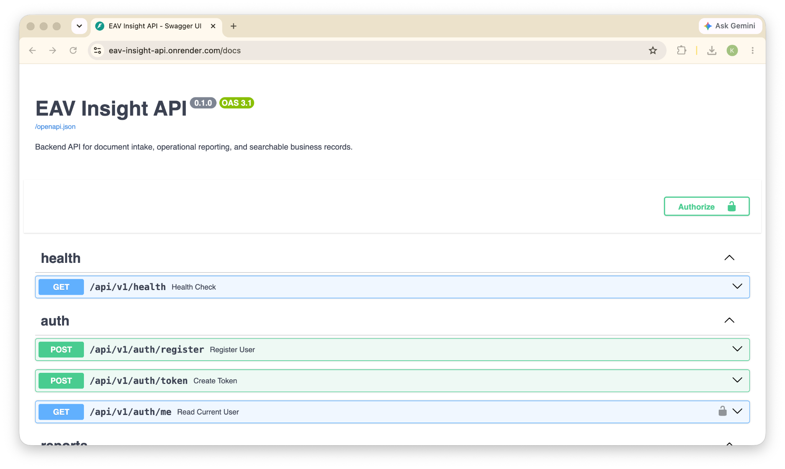
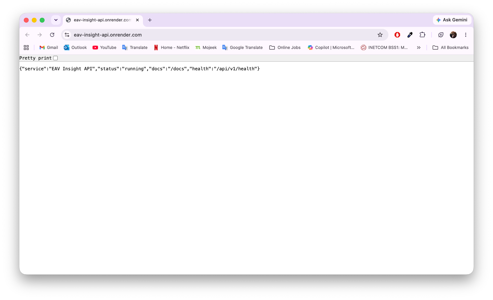
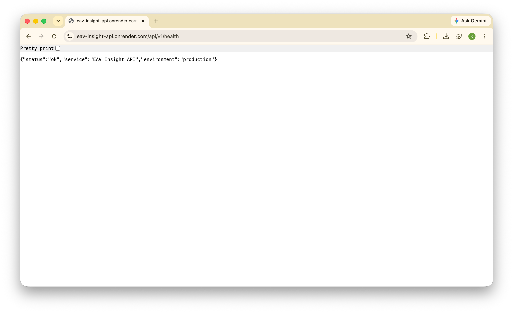
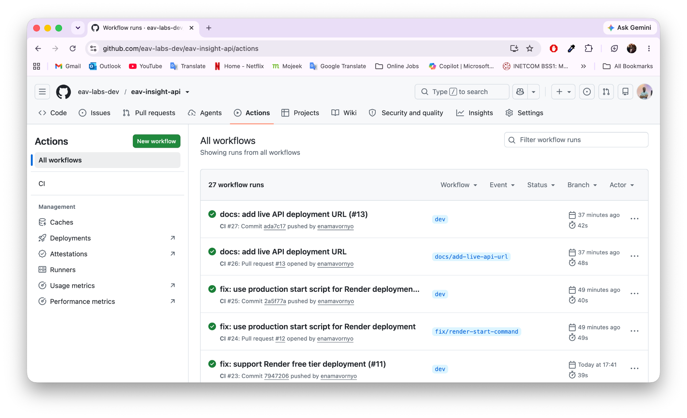
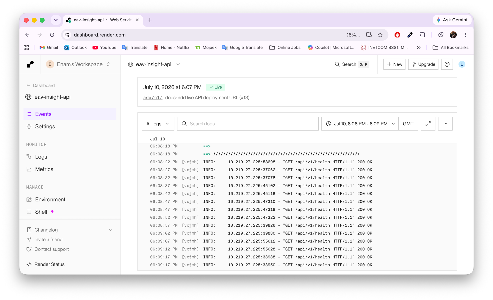
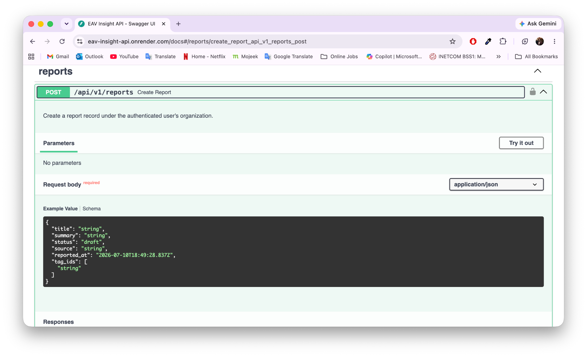
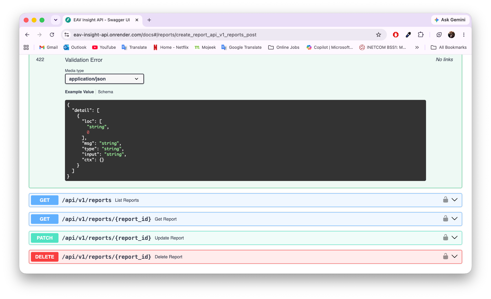
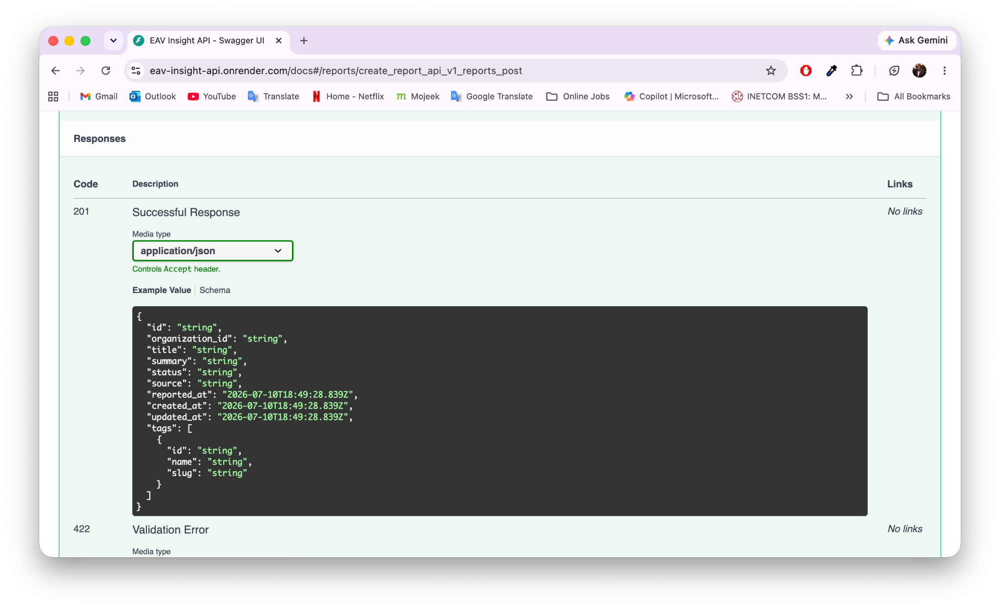

# EAV Insight API — Reviewer Screenshots Guide

## Purpose

This file defines the screenshots that should be added to the repository before the project is considered fully portfolio-polished.

Recommended location:

```text
docs/assets/screenshots/
```

## Required Screenshots

### 1. Live Root Endpoint

URL:

```text
https://eav-insight-api.onrender.com/
```

Expected response:

```json
{
  "service": "EAV Insight API",
  "status": "running",
  "docs": "/docs",
  "health": "/api/v1/health"
}
```

```text
docs/assets/screenshots/live-root-endpoint.png
```

### 2. Live Health Endpoint

URL:

```text
https://eav-insight-api.onrender.com/api/v1/health
```

```text
docs/assets/screenshots/live-health-endpoint.png
```

### 3. Swagger / OpenAPI Docs

URL:

```text
https://eav-insight-api.onrender.com/docs
```

```text
docs/assets/screenshots/swagger-overview.png
```

### 4. Auth Endpoints in Swagger

Capture:

- `/api/v1/auth/register`
- `/api/v1/auth/token`
- `/api/v1/auth/me`

```text
docs/assets/screenshots/swagger-auth-endpoints.png
```

### 5. Report and Document Endpoints in Swagger

Capture:

- report endpoints
- document endpoints
- search/filter/pagination parameters

```text
docs/assets/screenshots/swagger-business-endpoints.png
```

### 6. GitHub Actions Passing CI

Capture a passing CI workflow run.

```text
docs/assets/screenshots/github-actions-ci.png
```

### 7. Render Deployment Success

Capture the Render service dashboard showing a successful deploy.

```text
docs/assets/screenshots/render-deployment-success.png
```

## README Screenshot Section Template

Add this after the Live Demo section when screenshots exist:

```md
## Screenshots

### OpenAPI Documentation


### Live Health Check


### CI Status


```

## Captured Screenshots

The repository now includes the reviewer screenshots below. These images give reviewers visual proof that the API is live, documented, deployed, and checked by CI.

| Screenshot         | Purpose                                                | File                                                               |
| ------------------ | ------------------------------------------------------ | ------------------------------------------------------------------ |
| Swagger docs home  | Shows live OpenAPI documentation and grouped endpoints | `docs/assets/screenshots/swagger-docs.png`                         |
| GitHub Actions CI  | Shows passing CI workflow runs                         | `docs/assets/screenshots/github-actions-ci.png`                    |
| Live health check  | Shows production health endpoint response              | `docs/assets/screenshots/live-health-check.png`                    |
| Render deployment  | Shows live Render deployment and health-check logs     | `docs/assets/screenshots/render-deployment.png`                    |
| Live root endpoint | Shows public root endpoint metadata                    | `docs/assets/screenshots/live-root-endpoint.png`                   |
| Business endpoints | Shows protected report/document API endpoints          | `docs/assets/screenshots/swagger-business-endpoints.png`           |
| Error responses    | Shows documented validation/error behavior             | `docs/assets/screenshots/swagger-business-endpoints-errors.png`    |
| Response examples  | Shows documented successful response schema            | `docs/assets/screenshots/swagger-business-endpoints-responses.png` |

### Swagger Docs Home



### Live Root Endpoint



### Live Health Check



### GitHub Actions CI



### Render Deployment



### Business Endpoints



### Error Responses



### Response Examples


